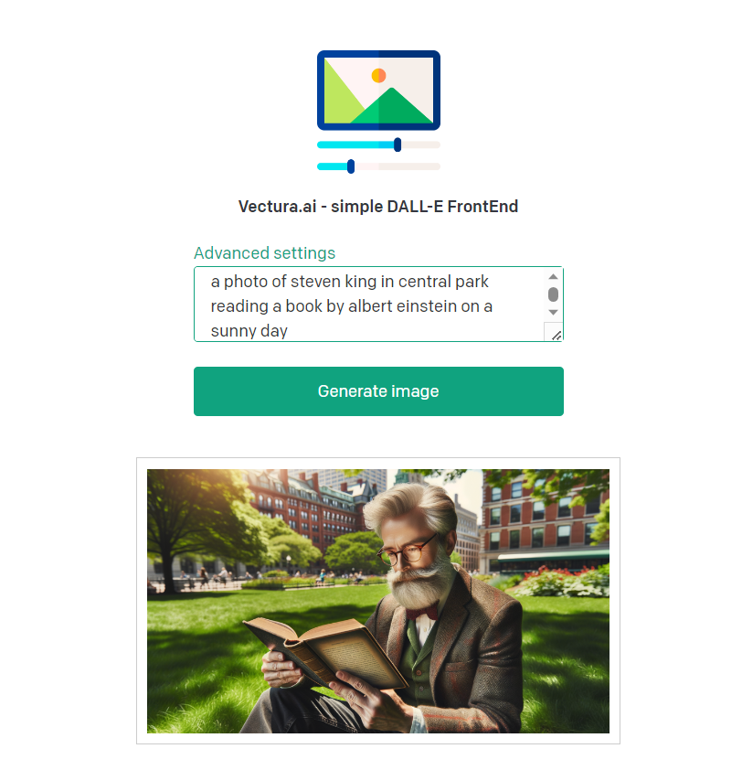
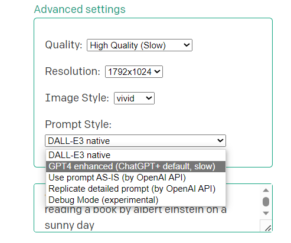
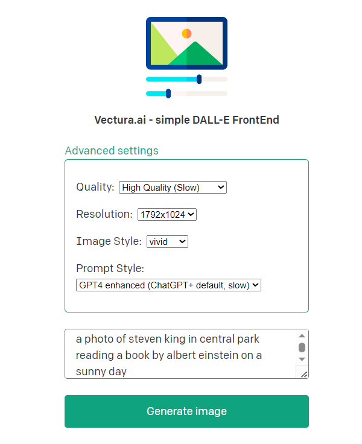

# Vectura.ai - Simple Dall-E3 FrontEnd

This is kind-of-fork of the OpenAI Example WebServer for running request against GPT4 but modified to instead be an UI making Dall-E3 usable via the Enterprise API.

## What are the advantages?
- It's cheaper then the GPT Enterprise and GPT+ subscription
- The output quality is higher because the HD flag can be set by default (otherwise OpenAI decides it based on whatever)
- There is no rate limit (currently OpenAI limits you to a couple of images per hour)

## Screenshots & Usage

<div align="center">
  
  <br>
  <em>A simple UI that by defaults sends requests vanilla to the DALL-E3 API</em>
</div>

<div align="center">
   
  <br>
  <em>The 'Advanced settings' allow for invoking GPT-4 apply advanced API flags</em>
</div>


## Setup - Instruction from the original source 

1. If you don’t have Node.js installed, [install it from here](https://nodejs.org/en/) (Node.js version >= 14.6.0 required)

2. Clone this repository

3. Navigate into the project directory

   ```bash
   $ cd openai-quickstart-node
   ```

4. Install the requirements

   ```bash
   $ npm install
   ```

5. Make a copy of the example environment variables file

   On Linux systems: 
   ```bash
   $ cp .env.example .env
   ```

6. Add your API Key to the `.env` file

### For testing run the app likes this

7. Run the app

   ```bash
   $ npm run dev
   ```

### For production (once you like it) run the app like this

7. Build the app

   ```bash
   $ npm run build
   $ npm run start
   ```

You should now be able to access the app at [http://localhost:3000/image-gen/](http://localhost:3000/image-gen/)

## For Debugging and development

Start of by setting `debug` to true in `generate.js`

# If you enjoy this app checkout our AI newsletter!
At Vectura.ai we are developing AI solutions for SME's and trying to open-source most of them or at least part of the toolchain. If you want to learn about tipps and tricks, get to know new tools sign-up for our Newsletter (at least once per month) here: [Vectura Newsletter](https://bit.ly/vectura)
